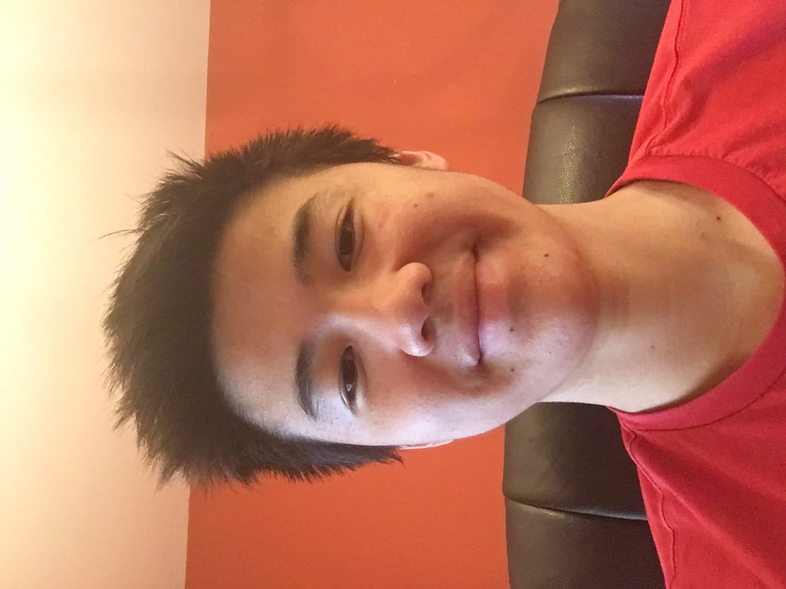

# Welcome to my first GitHub Pages site using Jekyll!

This is a project for AP Computer Science, titled "Final Website." In the project, I must show my name, a picture, my social media information, and a brag sheet. Enjoy!

---

## What is my name?

My name is Edison Wang.

> **Fun fact:** I was named Edison after the famous inventor, Thomas Edison.

## What do I look like?

Here is a picture of me:

## What social media do I use?

Click on each of the app icons to see my social media information

  

## Do I have a brag sheet to show?

Of course! Given that college is coming up soon, I will need to prepare a brag sheet to show off my talents, achievements, and important positions. Here is a brag sheet that I am currently developing:

- **Academics**
  - All honors or AP classes
  - Straight A's across all subjects
  - Hobby in programming with a portfolio as evidence
  - Won a regional competition in Green Generation for Science Olympiad and placed high in the other activity
  - Participating in the Chemistry Science Team
  - SET member of the John Hopkins Grand Ceremony
- **Athletics**
  - Participated in multiple competitions, including JOs and Sectionals
  - Best cut is currently a FUTR cut in the 200 back LC
- **Work Experience**
  - Volunteering with audio at the local Chinese school

Obviously, I will still need to achieve more in all topics, especially in athletics and work experience.
